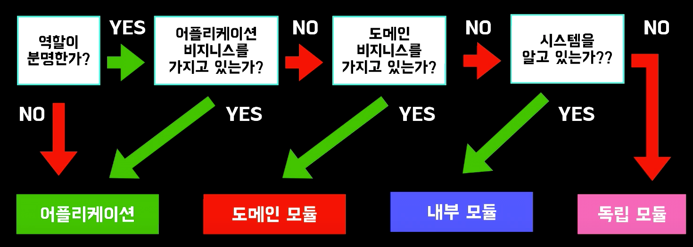
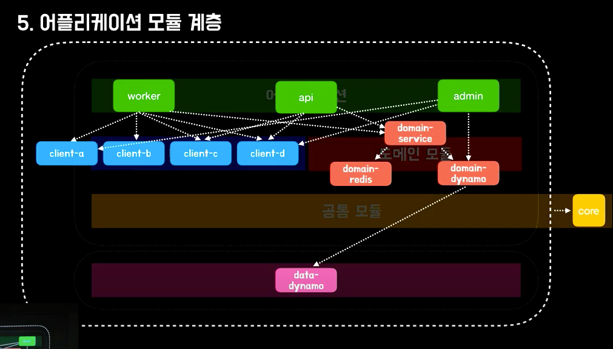

Multi Module Project Layer
===

---

하나의 시스템을 5가지의 모듈 계층으로 구분
---
> ### Inside the system : 시스템 내부
> > - Application : 어플리케이션
> > - in system available : 내부 모듈
> > - system domain : 도메인 모듈
> > - system core : 공통 모듈
> ### Outside the system : 시스템 외부
> > - independently available : 독립 모듈

---

System Module Layer 구성 원칙
---

```
    각 모듈 계층을 설계할 때 명확한 역할과 영향 범위를 지정
```

> ### 어플리케이션 계층
> > - 역할이 분명하지 않은 경우 
> > - 어플리케이션 비지니스를 가지고 있는 경우
> > - 하위 계층의 여러 모듈을 조합하여 기능을 제공하는 계층
> > > - EX) 

> ### 내부 모듈 계층
> > - 시스템 안에서 의미를 가진다.
> > - 어플리케이션과 도메인의 비지니스와 관계 없다.
> > > - EX) client : 외부 통신 담당 
> > >  - 환경별 시스템 Host, Header 관리
> > >  - 요청, 응답 Spec 관리
> > >  - 예외 처리 추상화 수준 통일

> ### 도메인 모듈 계층
> > - 어플리케이션의 비지니스와 관계 없다.
> > - 하나의 모듈은 최대 하나의 Infrastructure에 대한 책임만 가진다.
> > - 도메인 모듈을 조합한 더 큰 단위의 도메인 모듈이 있을 수 있다.
> > > - EX) domain-rds
> > >   - Infrastructure 연동 관리
> > >   - 도메인 계층 구현

> ### 공통 모듈 계층
> > - 공통 모듈의 비중이 커지지 않도록 Ttpe, Util 등을 정의한다.
> > - 공통 모듈을 참조하는 모듈의 미 사용 리소스 할당을 막기 위해 순수 java, kotlin 코드만 작성 하도록 제약을 둔다.
> > > - EX) 
> > >   - 날짜 객체 처리를 위한 Util

> ### 독립 모듈 계층
> > - 시스템과 관련 없이 자체로서 독립적인 역할을 수행 한다.

참조 URL :
 - [강의:우아한테크세미나-우아한멀티모듈](https://www.youtube.com/watch?v=nH382BcycHc)
 - [자료:우아한테크세미나-우아한멀티모듈](https://www.slideshare.net/ssuser59a869/ss-167401606)



---

효과
---
 - 각 모듈이 갖는 책임과 역할이 명확하여 리펙토링, 기능 변경 시 영향 범위 파악 용이
 - 경계가 명확해짐으로써 기능 제공 범위의 예측이 가능하며 스파케티 코드 발생 가능성 저하
 - 역할과 책임에 대한 애매함이 없어짐으로써 어떤 모듈에서 어느정도 까지를 개발해야 할지 명확